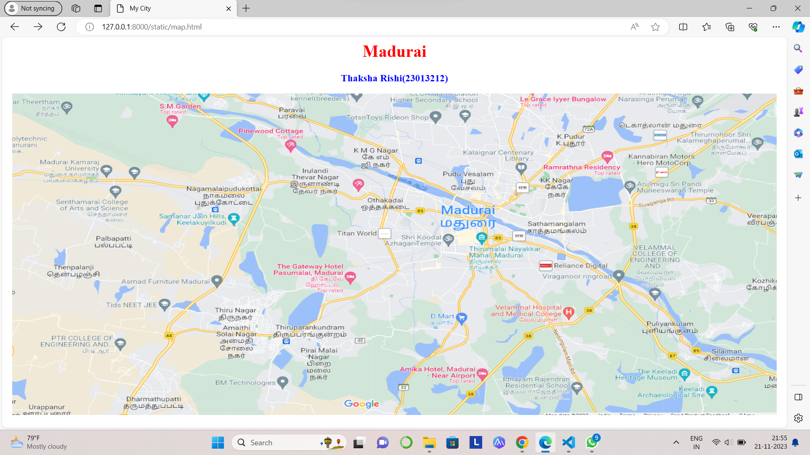
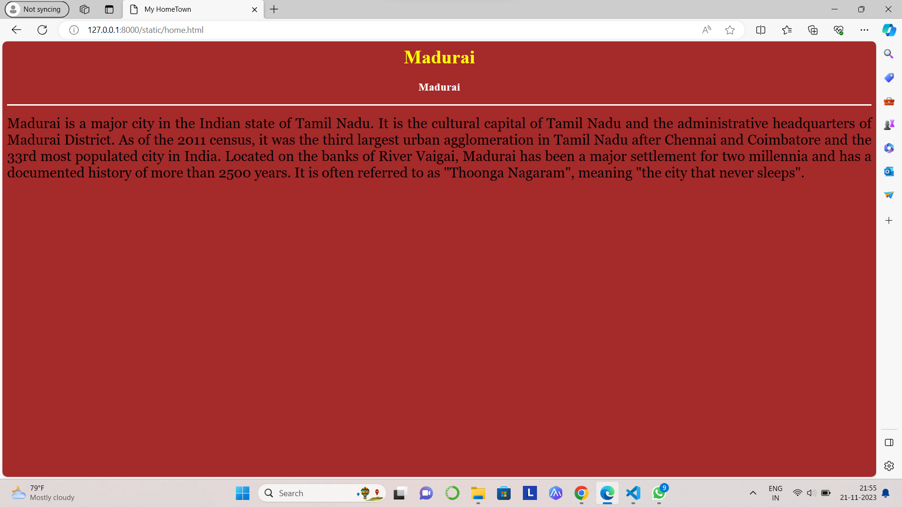
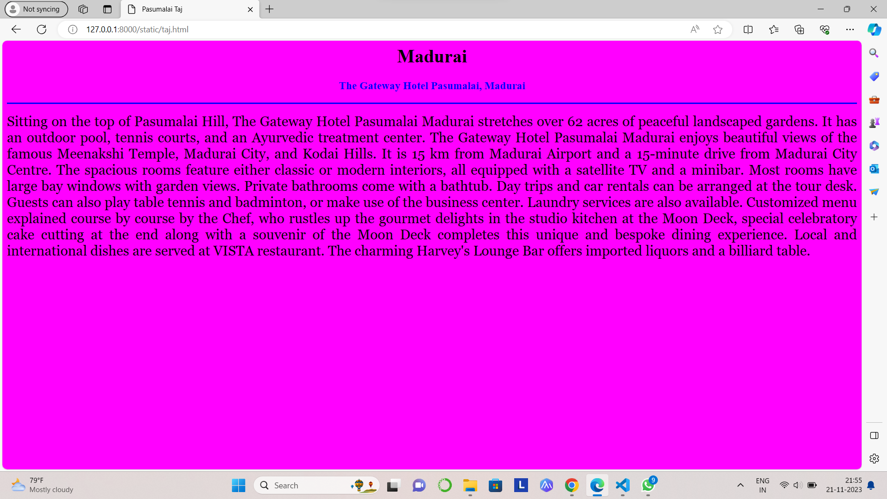
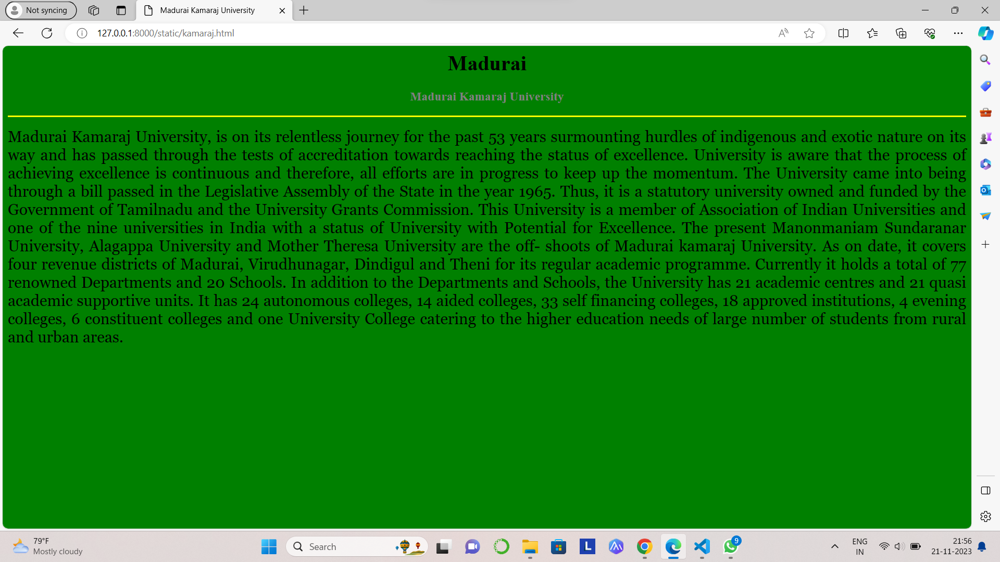
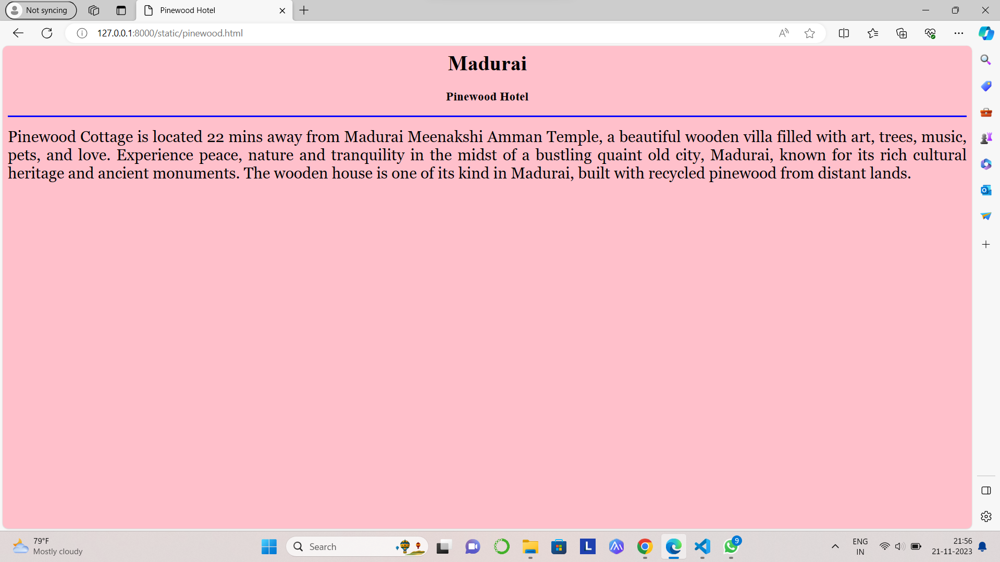
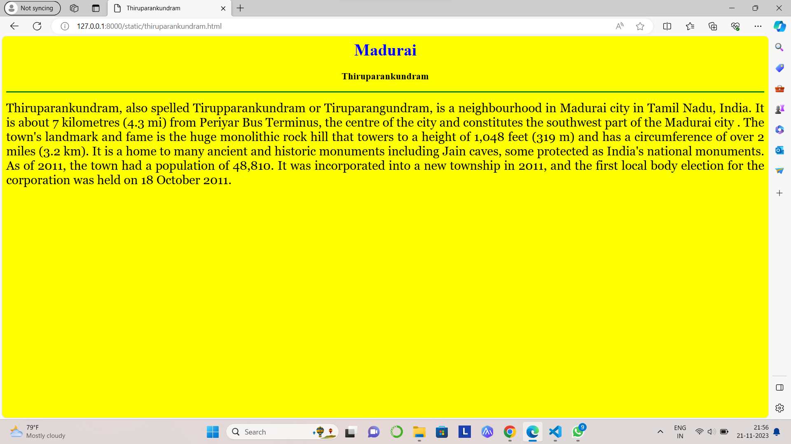

# Ex04 Places Around Me
## Date: 21.11.2023

## AIM
To develop a website to display details about the places around my house.

## DESIGN STEPS

### STEP 1
Create a Django admin interface.

### STEP 2
Download your city map from Google.

### STEP 3
Using ```<map>``` tag name the map.

### STEP 4
Create clickable regions in the image using ```<area>``` tag.

### STEP 5
Write HTML programs for all the regions identified.

### STEP 6
Execute the programs and publish them.

## CODE
```
map.html
<html>
<head>
<title>My City</title>
</head>
<boy>
<h1 align="center">
<font color="red"><b>Madurai</b></font>
</h1>
<h3 align="center">
<font color="blue"><b>Thaksha Rishi(23013212)</b></font>
</h3>
<center>

<map name="MyCity">
<area shape="circle" coords="850,220,30" href="home.html" title="My HomeTown">
<area shape="circle" coords="650,350,30" href="taj.html" title="Pasumalai Taj">
<area shape="circle" coords="580,450,30" href="thiruparankundram.html" title="Thiruparankundram">
<area shape="circle" coords="150,150,30" href="kamaraj.html" title="Madurai Kamaraj University">
<area shape="circle" coords="540,120,30" href="pinewood.html" title="Pinewood Cottage">
</map>
</center>
</body>
</html>

taj.html
<html>
    <head>
        <title>Pasumalai Taj</title>
    </head>
    <body bgcolor="magenta">
    <h1 align="center">
        <font color="black"><b>Madurai</b></font>
    </h1>
<h3 align="center">
    <font color="blue"><b>The Gateway Hotel Pasumalai, Madurai</b></font>
    </h3>
    <hr size="3" color="blue">
    <p align="justify">
        <font face="Georgia" size="5">
            Sitting on the top of Pasumalai Hill, The Gateway Hotel Pasumalai Madurai stretches over 62 acres of peaceful landscaped
            gardens. It has an outdoor pool, tennis courts, and an Ayurvedic treatment center. The Gateway Hotel Pasumalai Madurai 
            enjoys beautiful views of the famous Meenakshi Temple, Madurai City, and Kodai Hills. It is 15 km from Madurai Airport and 
            a 15-minute drive from Madurai City Centre. The spacious rooms feature either classic or modern interiors, all equipped with
            a satellite TV and a minibar. Most rooms have large bay windows with garden views. Private bathrooms come with a bathtub.
            Day trips and car rentals can be arranged at the tour desk. Guests can also play table tennis and badminton, or make use of 
            the business center. Laundry services are also available. Customized menu explained course by course by the Chef, who
            rustles up the gourmet delights in the studio kitchen at the Moon Deck, special celebratory cake cutting at the end along 
            with a souvenir of the Moon Deck completes this unique and bespoke dining experience. Local and international dishes are 
            served at VISTA restaurant. The charming Harvey's Lounge Bar offers imported liquors and a billiard table.
        </font>
    </p>
</h3></body>
</html>

thiruparankundram.html
<html>
    <head>
        <title>Thiruparankundram</title>
    </head>
    <body bgcolor="yellow">
    <h1 align="center">
        <font color="blue"><b>Madurai</b></font>
    </h1>
<h3 align="center">
    <font color="black"><b>Thiruparankundram</b></font>
    </h3>
    <hr size="3" color="green">
    <p align="justify">
        <font face="Georgia" size="5">
            Thiruparankundram, also spelled Tirupparankundram or Tiruparangundram, is a neighbourhood in Madurai city in Tamil Nadu,
            India. It is about 7 kilometres (4.3 mi) from Periyar Bus Terminus, the centre of the city and constitutes the southwest 
            part of the Madurai city . The town's landmark and fame is the huge monolithic rock hill that towers to a height of 1,048 
            feet (319 m) and has a circumference of over 2 miles (3.2 km). It is a home to many ancient and historic monuments including
            Jain caves, some protected as India's national monuments.

            As of 2011, the town had a population of 48,810. It was incorporated into a new township in 2011, and the first local body 
            election for the corporation was held on 18 October 2011.
</font>
</p>
</h3>
</body>
</html>

kamaraj.html
<html>
    <head>
        <title>Madurai Kamaraj University</title>
    </head>
    <body bgcolor="green">
    <h1 align="center">
        <font color="black"><b>Madurai</b></font>
    </h1>
<h3 align="center">
    <font color="gray"><b>Madurai Kamaraj University</b></font>
    </h3>
    <hr size="3" color="yellow">
    <p align="justify">
        <font face="Georgia" size="5">
            Madurai Kamaraj University, is on its relentless journey for the past 53 years surmounting hurdles of indigenous and exotic
            nature on its way and has passed through the tests of accreditation towards reaching the status of excellence. University 
            is aware that the process of achieving excellence is continuous and therefore, all efforts are in progress to keep up the
            momentum.

            The University came into being through a bill passed in the Legislative Assembly of the State in the year 1965. Thus, it is
            a statutory university owned and funded by the Government of Tamilnadu and the University Grants Commission. This University
            is a member of Association of Indian Universities and one of the nine universities in India with a status of University with
            Potential for Excellence. The present Manonmaniam Sundaranar University, Alagappa University and Mother Theresa University 
            are the off- shoots of Madurai kamaraj University. As on date, it covers four revenue districts of Madurai, Virudhunagar,
            Dindigul and Theni for its regular academic programme. Currently it holds a total of 77 renowned Departments and 20 Schools.
            In addition to the Departments and Schools, the University has 21 academic centres and 21 quasi academic supportive units. 
            It has 24 autonomous colleges, 14 aided colleges, 33 self financing colleges, 18 approved institutions, 4 evening colleges,
            6 constituent colleges and one University College catering to the higher education needs of large number of students from
            rural and urban areas.
        </font>
</p>
</h3>
</body>
</html>

pinewood.html
<html>
    <head>
        <title>Pinewood Hotel</title>
    </head>
    <body bgcolor="pink">
    <h1 align="center">
        <font color="black"><b>Madurai</b></font>
    </h1>
<h3 align="center">
    <font color="black"><b>Pinewood Hotel</b></font>
    </h3>
    <hr size="3" color="blue">
    <p align="justify">
        <font face="Georgia" size="5">
            Pinewood Cottage is located 22 mins away from Madurai Meenakshi Amman Temple, a beautiful wooden villa filled with art,
            trees, music, pets, and love. Experience peace, nature and tranquility in the midst of a bustling quaint old city, Madurai,
            known for its rich cultural heritage and ancient monuments. The wooden house is one of its kind in Madurai, built with
            recycled pinewood from distant lands.
</font>
</p>
</h3>
</body>
</html>
</p>
</h3>
</body>
</html>

home.html
<html>
    <head>
        <title>My HomeTown</title>
    </head>
    <body bgcolor="brown">
    <h1 align="center">
        <font color="yellow"><b>Madurai</b></font>
    </h1>
<h3 align="center">
    <font color="white"><b>Madurai</b></font>
    </h3>
    <hr size="3" color="white">
    <p align="justify">
        <font face="Georgia" size="5">
           Madurai is a major city in the Indian state of Tamil Nadu. It is the cultural capital of Tamil Nadu and the administrative
           headquarters of Madurai District. As of the 2011 census, it was the third largest urban agglomeration in Tamil Nadu after
           Chennai and Coimbatore and the 33rd most populated city in India.  Located on the banks of River Vaigai, Madurai has been
           a major settlement for two millennia and has a documented history of more than 2500 years. It is often referred to as
           "Thoonga Nagaram", meaning "the city that never sleeps".
</font>
</p>
</h3>
</body>
</html>
</p>
</h3>
</body>
</html>
```

## OUTPUT








## RESULT
The program for implementing image maps using HTML is executed successfully.
